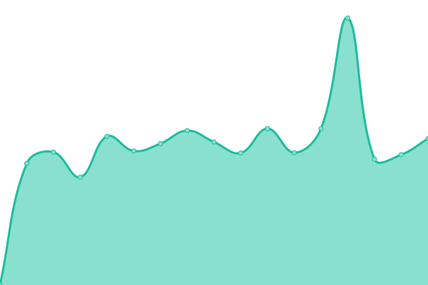

# [📈 Live Status](https://joahua.github.io/anumon): <!--live status--> **🟧 Partial outage**

This repository contains the open-source uptime monitor and status page for [Josh](https://josh.st), powered by [Upptime](https://github.com/upptime/upptime).

With [Upptime](https://upptime.js.org), you can get your own unlimited and free uptime monitor and status page, powered entirely by a GitHub repository. We use [Issues](https://github.com/joahua/anumon/issues) as incident reports, [Actions](https://github.com/joahua/anumon/actions) as uptime monitors, and [Pages](https://joahua.github.io/anumon) for the status page.

<!--start: status pages-->
<!-- This summary is generated by Upptime (https://github.com/upptime/upptime) -->
<!-- Do not edit this manually, your changes will be overwritten -->
<!-- prettier-ignore -->
| URL | Status | History | Response Time | Uptime |
| --- | ------ | ------- | ------------- | ------ |
|  [ANU](https://www.anu.edu.au/) | 🟥 Down | [anu.yml](https://github.com/joahua/anumon/commits/HEAD/history/anu.yml) | 

 2156ms
     
 | 

<a href="https://joahua.github.io/anumon/history/anu">99.61%</a>
    

|  [Services](https://services.anu.edu.au/) | 🟥 Down | [services.yml](https://github.com/joahua/anumon/commits/HEAD/history/services.yml) | 

 2199ms
     
 | 

<a href="https://joahua.github.io/anumon/history/services">99.62%</a>
    

|  [Law](https://law.anu.edu.au/) | 🟥 Down | [law.yml](https://github.com/joahua/anumon/commits/HEAD/history/law.yml) | 

 1887ms
     
 | 

<a href="https://joahua.github.io/anumon/history/law">99.63%</a>
    

|  [Find](https://find.anu.edu.au/search?q=vc) | 🟥 Down | [find.yml](https://github.com/joahua/anumon/commits/HEAD/history/find.yml) | 

 2089ms
     
 | 

<a href="https://joahua.github.io/anumon/history/find">99.37%</a>
    

|  [Reporter](https://reporter.anu.edu.au/) | 🟩 Up | [reporter.yml](https://github.com/joahua/anumon/commits/HEAD/history/reporter.yml) | 

 530ms
     
 | 

<a href="https://joahua.github.io/anumon/history/reporter">100.00%</a>
    

|  [CAP](https://asiapacific.anu.edu.au/) | 🟥 Down | [cap.yml](https://github.com/joahua/anumon/commits/HEAD/history/cap.yml) | 

 10995ms
     
 | 

<a href="https://joahua.github.io/anumon/history/cap">88.93%</a>
    

|  [CECC](https://cecc.anu.edu.au/) | 🟥 Down | [cecc.yml](https://github.com/joahua/anumon/commits/HEAD/history/cecc.yml) | 

 2639ms
     
 | 

<a href="https://joahua.github.io/anumon/history/cecc">99.66%</a>
    

|  [Test Broken Site](https://thissitedoesnotexist.koj.co) | 🟥 Down | [test-broken-site.yml](https://github.com/joahua/anumon/commits/HEAD/history/test-broken-site.yml) | 

 0ms
     
 | 

<a href="https://joahua.github.io/anumon/history/test-broken-site">100.00%</a>
    

<!--end: status pages-->

[**Visit our status website →**](https://joahua.github.io/anumon)

## 📄 License

- Powered by: [Upptime](https://github.com/upptime/upptime)
- Code: [MIT](./LICENSE) © [Anand Chowdhary](https://anandchowdhary.com), supported by [Pabio](https://pabio.com)
- Data in the `./history` directory: [Open Database License](https://opendatacommons.org/licenses/odbl/1-0/)
